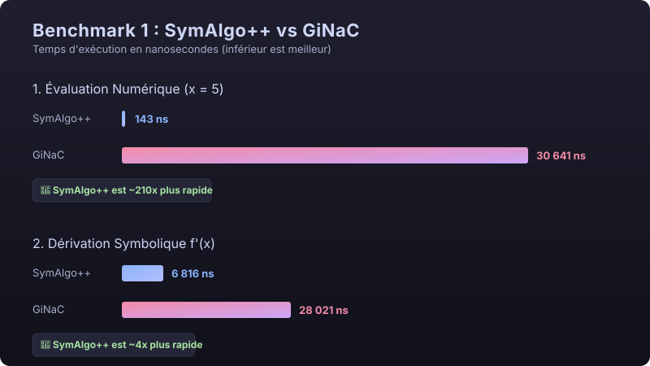
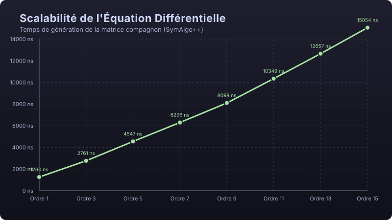

# SymAlgo++

SymAlgo++ est une bibliothèque C++17 moderne et performante conçue pour représenter, manipuler, évaluer, dériver, intégrer et simplifier des expressions algébriques classiques ainsi que des équations différentielles ordinaires (EDO). Elle s'appuie sur une modélisation orientée objet robuste utilisant un Arbre de Syntaxe Abstraite (AST) pour le calcul symbolique et des solveurs algébriques/numériques intégrés.

Face à GiNaC, bibliothèque C++ de calcul formel de référence, SymAlgo++ est plus rapide sur tous les scénarios mesurés et son empreinte mémoire est plus faible (voir [Benchmarks](#-benchmarks-de-performances)).

Un schéma détaillé de l'architecture et du cheminement d'une expression est disponible dans [`docs/ARCHITECTURE.md`](docs/ARCHITECTURE.md).

---

## 🏛️ Architecture de la bibliothèque

Le projet est structuré autour d'une hiérarchie de classes exploitant le polymorphisme et le C++17 moderne. Toute la bibliothèque est déclarée dans l'espace de noms `symalgo`.

* **`Equation`** : Classe abstraite de base définissant l'interface commune de toutes les équations du système.
  * `eval(double x)` : Évalue l'équation pour une valeur réelle donnée.
  * `deriveeGenerique()` : Dérivée polymorphe, renvoyée sous forme de `std::unique_ptr<Equation>`. Chaque classe dérivée propose aussi `derivee()`, qui renvoie son propre type par valeur.
* **`EquationClassique`** (hérite d'`Equation`) : Encapsule une expression (AST) et fournit dérivation formelle, intégration symbolique, limites, développements limités, tracé adaptatif et évaluation compilée.
* **`EquationDifferentielle`** (hérite d'`Equation`) : Représente des équations différentielles linéaires de la forme $\sum a_i y^{(i)} = 0$. Offre à la fois une résolution analytique exacte et une résolution numérique via Runge-Kutta 4 (RK4) basée sur la matrice compagnon d'état (Eigen).

---

## 🌲 Expressions symboliques (AST)

### Un modèle d'expressions sans copie ni doublon

* **Forme canonique automatique** : les expressions sont construites directement sous forme réduite, comme dans les systèmes de calcul formel. Sommes et produits sont n-aires, leurs termes triés, et les termes semblables regroupés dès la construction :
  * `x + x` donne `2*x`, `x * x^2` donne `x^3`, `2*(x + 1)` donne `2*x + 2` ;
  * `x - y` est `x + (-1)*y` et `x / y` est `x*y^(-1)` : un quotient est un produit à exposants négatifs ;
  * `(x + 1)/(x + 1)` donne `1`, `exp(ln(x))` donne `x`.
* **Hash-consing** : chaque expression n'existe qu'une fois en mémoire. Deux expressions mathématiquement identiques sous forme canonique (`x + y` et `y + x`) sont le même pointeur, et l'égalité se teste par simple comparaison d'adresses.
* **Nombres exacts** : les coefficients sont des rationnels exacts de taille arbitraire (`Nombre`), stockés sur 64 bits tant qu'ils tiennent et basculant sur GMP au-delà : `1/3 + 1/6` donne `1/2`, `2^100` est calculé exactement, `4^(1/2)` donne `2`. `cst(2.0)` est l'entier exact 2, `cst(0.5)` le réel 0.5.
* **`ExprPtr`** : pointeur à compteur de références intrusif (`Ref<ASTNode>`) — une seule allocation par noeud, libération immédiate du dernier usage. Les noeuds ne se créent que par les helpers : la construction sur la pile est interdite à la compilation.

> **Threads** : comme GiNaC, SymAlgo++ ne permet pas de manipuler une même expression depuis plusieurs threads simultanément.

### Nœuds disponibles

1. **Terminaux** : `Constante` (nombre exact ou réel), `Variable` (la variable d'évaluation, quel que soit son nom), `Parametre` (constante symbolique sans valeur, comme les $C_1, C_2$ des solutions d'EDO : dérivée nulle, évaluation impossible).
2. **Sommes, produits, puissances** : `Somme` (constante + termes à coefficients exacts), `Produit` (coefficient + facteurs `base^exposant`), `Puissance`.
3. **Fonctions** : `Sinus`, `Cosinus`, `Tangente`, `Exponentielle`, `Logarithme`.
4. **Nœuds non évalués** : `IntegraleNonEvaluee` et `LimiteNonEvaluee` représentent une primitive ou une limite que la bibliothèque ne sait pas déterminer, au lieu d'un résultat faux.

### Construction

Des helpers (`cst`, `frac`, `nombre`, `var`, `param`, `somme`, `produit`, `ast_pow`, `ast_sin`, `ast_cos`, `ast_tan`, `ast_exp`, `ast_ln`) et les opérateurs `+ - * /` (y compris le moins unaire) permettent une écriture proche des mathématiques :

```cpp
auto X = var("x");
auto expr = frac(1, 3) * ast_pow(X, 2) + ast_sin(X) + ast_ln(X);
std::cout << expr;   // x^2/3 + sin(x) + ln(x)
```

---

## ⚡ Fonctionnalités

* **Dérivation (`derivee()`)** : sur le graphe partagé, chaque sous-expression n'est dérivée qu'une fois par appel ; le résultat est directement sous forme canonique.
* **Intégration symbolique (`integrer()`)** : polynômes, fonctions usuelles, linéarité, facteurs constants, substitution linéaire $\int f(ax+b)\,dx = F(ax+b)/a$. Hors de ces règles, le résultat est une `IntegraleNonEvaluee`.
* **Limites (`limite(x0)`)** : règle de L'Hôpital pour $0/0$ et $\infty/\infty$ (profondeur bornée), formes $0 \cdot \infty$, $1^\infty$, $0^0$, $\infty^0$ ; signe de l'infini déterminé par le développement du dénominateur. Exemples : $\sin(x)/x \to 1$, $x \ln x \to 0$, $x^x \to 1$ en 0. Une limite inexistante (ex. $1/x$ en 0) ou non déterminée est une `LimiteNonEvaluee`.
* **Développements limités (`DL(x0, ordre)`)** : calculés par arithmétique des séries tronquées (technique de la différentiation automatique) : l'ordre 20 de $e^{\sin x}$ s'obtient en quelques microsecondes.
* **Évaluation compilée** : une expression peut être compilée en un programme linéaire (sous-expressions partagées calculées une fois, registres réutilisés). `EquationClassique` compile automatiquement quand c'est rentable, et `eq.eval(xs)` évalue un tableau de points par blocs vectorisés.
* **Tracé adaptatif (`genererPointsTrace(xMin, xMax, tolerance)`)** : échantillonnage adaptatif récursif, qui raffine les zones de forte courbure.
* **Résolution littérale d'EDO (`resoudreLitteral()`)** : solution générale des équations linéaires homogènes à coefficients constants (racines réelles, complexes conjuguées et multiples : $x^k e^{rx}$).
* **Problème de Cauchy (`resoudreProblemeCauchy()`)** : solution exacte satisfaisant les conditions initiales, directement évaluable.
* **Solveur numérique d'EDO (RK4)** : schéma d'espace d'état sur la matrice compagnon (Eigen) ; chaque pas se réduit à un produit matrice-vecteur précalculé.

---

## 💡 Exemples d'utilisation

### 1. Expressions classiques, dérivation, intégration et limite
```cpp
#include <iostream>
#include "EquationClassique.hpp"
#include "ASTNode.hpp"

using namespace symalgo;

int main() {
    auto X = var("x");
    // (x^2 - 1) / (x - 1)
    auto expr = (ast_pow(X, 2) - 1.0) / (X - 1.0);
    EquationClassique eq(expr);

    std::cout << "Equation : ";
    eq.afficher();                                        // (x^2 - 1)/(x - 1) = 0

    // Calcul de la limite en x = 1 (L'Hôpital) -> 2
    EquationClassique eq_lim = eq.limite(1.0);
    std::cout << "Limite en x->1 : ";
    eq_lim.afficher();                                    // 2 = 0

    // Dérivation et intégration d'un polynôme (résultats renvoyés par valeur)
    EquationClassique poly(ast_pow(X, 2) + X * 5 + 6);
    EquationClassique poly_der = poly.derivee();
    EquationClassique poly_int = poly.integrer();

    std::cout << "Derivee   : "; poly_der.afficher();     // 2*x + 5 = 0
    std::cout << "Integrale : "; poly_int.afficher();     // x^3/3 + 5*x^2/2 + 6*x = 0

    // Évaluation vectorisée d'un tableau de points
    std::vector<double> ys = poly.eval(std::vector<double>{0.0, 1.0, 2.0}); // 6, 12, 20
    return 0;
}
```

### 2. Équations différentielles (littérale et numérique RK4)
```cpp
#include <iostream>
#include "EquationDifferentielle.hpp"
#include "EquationClassique.hpp"

using namespace symalgo;

int main() {
    // Oscillateur harmonique : y'' + 4y = 0
    EquationDifferentielle eq;
    eq.ajouterTerme(2, 1.0); // y''
    eq.ajouterTerme(0, 4.0); // 4y

    std::cout << "EDO : ";
    eq.afficher(); // y'' + 4*y = 0

    // Solution générale : C1, C2 sont des paramètres symboliques
    EquationClassique sol_generale = eq.resoudreLitteral();
    std::cout << "Solution analytique : ";
    sol_generale.afficher(); // C1*cos(2*x) + C2*sin(2*x) = 0

    // Avec les conditions initiales y(0)=1, y'(0)=0
    eq.setConditionsInitiales({1.0, 0.0});
    EquationClassique sol_exacte = eq.resoudreProblemeCauchy();
    sol_exacte.afficher(); // cos(2*x) = 0

    // Évaluation numérique via RK4
    std::cout << "Evaluation RK4 en x=pi/4 : " << eq.eval(3.141592653589793 / 4.0) << std::endl; // ~ 0
    return 0;
}
```

---

## 🛠️ Compilation et Tests

Dépendances : un compilateur C++17 (GCC ou Clang), **GMP** (arithmétique exacte), et **Eigen** (fourni dans `vendor/eigen`).

```bash
sudo pacman -S gmp            # Arch / EndeavourOS  (Debian/Ubuntu : libgmp-dev)
```

* **Compiler l'ensemble du projet** (bibliothèque, tests, démo) :
  ```bash
  make
  ```
* **Lancer la suite de tests** (mini-framework sans dépendance, `tests/test_framework.hpp` ; code de retour non nul en cas d'échec) :
  ```bash
  make run_tests
  ```
* **Lancer les tests sous AddressSanitizer et UndefinedBehaviorSanitizer** (fuites mémoire, accès invalides, comportements indéfinis) :
  ```bash
  make check
  ```
* **Lancer la démonstration** : `./bin/demo`
* **Nettoyer les fichiers de build** : `make clean`

---

## 📊 Benchmarks de Performances

Les performances de SymAlgo++ sont mesurées avec **Google Benchmark** et comparées à **GiNaC**, sur les mêmes expressions. La mémoire est mesurée en remplaçant `operator new/delete`, de la même façon pour les deux bibliothèques.

```bash
sudo pacman -S benchmark ginac # Arch / EndeavourOS
make bench
```

Médiane de 3 répétitions, Intel Celeron N4120 @ 1.10 GHz (Arch Linux, GCC 16, `-O3`) :

| Scénario | SymAlgo++ | GiNaC | Comparaison |
| :--- | ---: | ---: | :--- |
| Évaluation en un point | 123 ns | 30 820 ns | 🚀 ×250 |
| Évaluation d'une grande expression (dérivée 8e) | 1,1 µs | 1 607 µs | 🚀 ×1 450 |
| Évaluation de 10 000 points (par blocs) | 0,61 ms | 302 ms | 🚀 ×494 |
| Dérivée première (sous forme réduite) | 8,7 µs | 28,1 µs | 🚀 ×3,2 |
| Dérivée 10e de $e^{\sin x} x^2$ | 1,38 ms | 7,45 ms | 🚀 ×5,4 |
| Collecte de 100 termes semblables | 146 µs | 255 µs | 🚀 ×1,7 |
| Série de Taylor d'ordre 10 | 4,1 µs | 4 784 µs | 🚀 ×1 170 |
| Mémoire du résultat (dérivée 6e) | 4,2 Ko | 4,9 Ko | 🚀 −14 % |



* **Analyse** :
  * **Évaluation** : SymAlgo++ évalue directement en `double` (programme compilé pour les grandes expressions), là où GiNaC substitue puis évalue symboliquement.
  * **Calcul symbolique** : forme canonique, hash-consing et dérivation sur graphe partagé évitent toute copie et tout recalcul.
  * *Comparaison à nuancer* : GiNaC est un système de calcul formel complet, plus général (plusieurs variables, arithmétique exacte généralisée, développement de polynômes...).
* L'historique détaillé des mesures, chantier par chantier, est consigné dans [`benchmarks/RESULTATS.md`](benchmarks/RESULTATS.md).

### Scalabilité EDO (Génération Matrice Compagnon)



* **Analyse** : La génération de la matrice compagnon conserve une complexité $O(N)$ strictement linéaire par rapport à l'ordre $N$ de l'équation.

---

## 📂 Conventions et Contribution

* **Arborescence** :
  * `include/` : En-têtes de la bibliothèque (`.hpp`).
  * `src/` : Fichiers sources (`.cpp`), un module par responsabilité (voir `docs/ARCHITECTURE.md`).
  * `tests/` : Suite de tests automatisés.
  * `benchmarks/` : Benchmarks Google Benchmark, résultats et générateur de graphiques.
  * `docs/` : Documentation et visuels SVG.
* **Stratégie de branche** :
  Travail exclusivement sur branches dédiées (`feature/nom-de-la-tache`). Direct commit sur `main` proscrit.
* **Conventions de commit (en français)** :
  * `feat:` Nouvelle fonctionnalité.
  * `fix:` Correction de bogue.
  * `refactor:` Amélioration de structure/code.
  * `perf:` Optimisation mesurée.
  * `docs:` Documentation.
  * `chore:` Configuration, Makefile, .gitignore.
