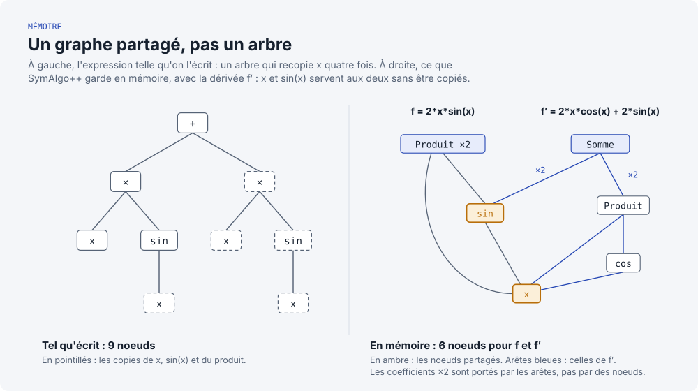
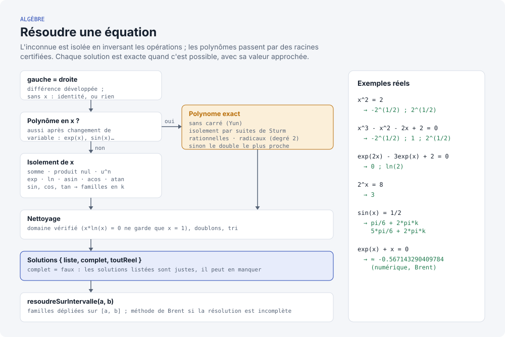
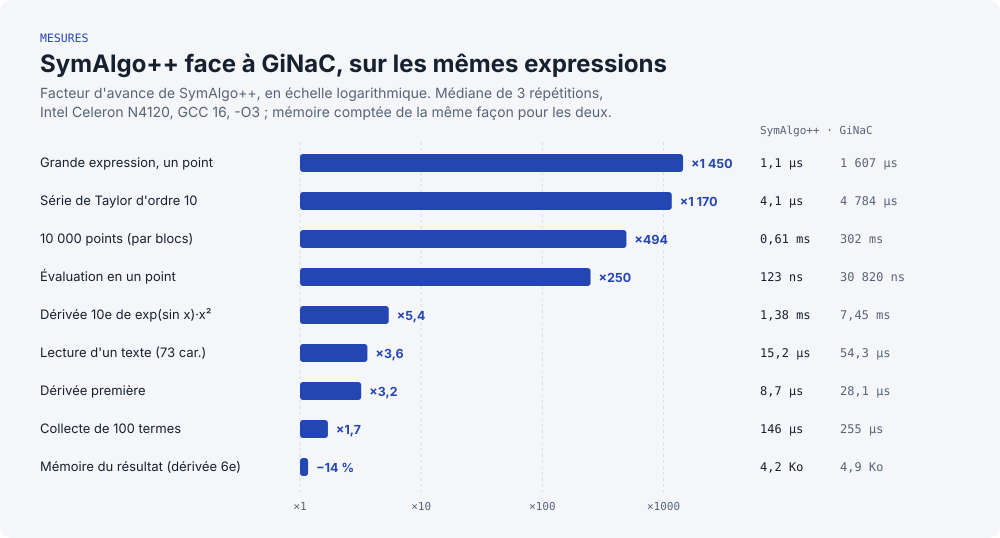
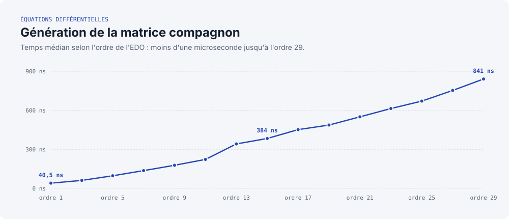

# SymAlgo++

SymAlgo++ est une bibliothèque C++17 de calcul symbolique. Elle représente, évalue, dérive, intègre, développe, factorise et **résout** des expressions algébriques, lues depuis du texte ou écrites en C++, ainsi que des équations différentielles ordinaires (EDO) linéaires.

```cpp
EquationClassique eq("exp(2x) - 3exp(x) + 2 = 0");
Solutions s = eq.resoudre();          // x = 0 ; x = ln(2), exactes
```

* **Exacte** : rationnels de taille arbitraire (`0.1 + 0.2` vaut `3/10`), constante `pi`, radicaux et valeurs remarquables exacts (`sin(pi/3) = 3^(1/2)/2`), racines de polynômes certifiées.
* **Rapide et sobre** : face à GiNaC, bibliothèque C++ de calcul formel de référence, SymAlgo++ est plus rapide sur tous les scénarios mesurés (de ×1,7 à ×1 450), et ses résultats occupent moins de mémoire ([mesures](#-performances)).
* **Sûre** : 125 cas de test, tous exécutés aussi sous AddressSanitizer et UndefinedBehaviorSanitizer (`make check`).

Le fonctionnement interne est détaillé dans [`docs/ARCHITECTURE.md`](docs/ARCHITECTURE.md).

---

## 🏛️ Architecture

<picture>
  <source media="(prefers-color-scheme: dark)" srcset="docs/images/architecture-sombre.svg">
  
</picture>

Toute la bibliothèque est dans l'espace de noms `symalgo`.

* **`Equation`** : classe abstraite commune (`eval(x)`, `deriveeGenerique()` qui renvoie un `std::unique_ptr<Equation>`). Chaque classe dérivée propose aussi `derivee()`, qui renvoie son propre type par valeur.
* **`EquationClassique`** : encapsule une expression et fournit dérivation, intégration, limites, développements limités, développement et factorisation, résolution, tracé adaptatif et évaluation compilée. Se construit depuis un `ExprPtr` ou depuis du texte.
* **`EquationDifferentielle`** : équations linéaires $\sum a_i y^{(i)} = 0$, résolues exactement (solution générale, problème de Cauchy) ou numériquement (RK4 sur la matrice compagnon, avec Eigen).

---

## 🌲 Expressions symboliques

### Construction

Un seul en-tête donne accès à toute la bibliothèque : `#include <symalgopp>` (ou `<symalgopp.hpp>`). Les en-têtes restent utilisables un par un pour réduire le temps de compilation.

**Depuis du texte** (`include/Lecture.hpp`) :

```cpp
ExprPtr e = lire("x^2 + 3*sin(x)");
EgaliteLue eq = lireEquation("sin(x) = 1/2");     // eq.gauche, eq.droite
EquationClassique f("x^2 = 2");                   // gauche - droite = 0
using namespace symalgo::litteraux;
ExprPtr g = "x^2 + 1"_expr;
```

* Nombres **exacts**, décimaux compris : `0.1` est le rationnel 1/10, `2.5e-3` vaut 1/400, les entiers sont de taille arbitraire.
* Précédences usuelles, `^` (ou `**`) associatif à droite, multiplication implicite : `2x`, `3(x + 1)`, `(x + 1)(x - 1)`, `x sin(x)`.
* Fonctions `sin cos tan exp ln log sqrt asin acos atan` (et `arcsin`...), constantes `pi` (ou `π`) et `e`. La variable est `x` (modifiable : `lire("t^2", {"t"})`) ; tout autre nom est un paramètre (`a*x + b`).
* Symboles `× · ÷ − ² ³` acceptés. Une erreur (`ErreurLecture`) indique la position et montre le texte :
  ```
  lecture, position 5 : expression attendue
    x + * 2
        ^
  ```
* Le texte affiché d'une expression exacte se relit en **le même nœud** : `lire(e->texte()) == e`.

**En C++** : helpers (`cst`, `frac`, `nombre`, `var`, `param`, `pi`, `somme`, `produit`, `ast_pow`, `ast_sin`, `ast_cos`, `ast_tan`, `ast_exp`, `ast_ln`, `ast_asin`, `ast_acos`, `ast_atan`, `substituer`) et opérateurs `+ - * /` :

```cpp
auto X = var("x");
auto expr = frac(1, 3) * ast_pow(X, 2) + ast_sin(X) + ast_ln(X);
std::cout << expr;   // x^2/3 + sin(x) + ln(x)
```

### Un modèle sans copie ni doublon

<picture>
  <source media="(prefers-color-scheme: dark)" srcset="docs/images/construction-sombre.svg">
  
</picture>

* **Forme canonique automatique** : chaque opération produit directement la forme réduite. Sommes et produits sont n-aires, triés, et les termes semblables regroupés dès la construction :
  * `x + x` donne `2*x`, `x * x^2` donne `x^3`, `2*(x + 1)` donne `2*x + 2` ;
  * `x - y` est `x + (-1)*y` et `x / y` est `x*y^(-1)` : un quotient est un produit à exposants négatifs ;
  * `(x + 1)/(x + 1)` donne `1`, `exp(ln(x))` donne `x`, `8^(1/2)` donne `2*2^(1/2)`.
* **Hash-consing** : chaque expression n'existe qu'une fois en mémoire. `x + y` et `y + x` sont le même pointeur : l'égalité est une comparaison d'adresses.
* **Nombres exacts** (`Nombre`) : rationnels sur 64 bits tant qu'ils tiennent, GMP au-delà. `1/3 + 1/6` donne `1/2`, `2^100` est exact. En C++, `cst(2.0)` est l'entier exact 2, `cst(0.5)` le réel 0.5.
* **`ExprPtr`** : compteur de références intrusif (`Ref<ASTNode>`), une seule allocation par nœud. Les nœuds ne se créent que par les helpers : la construction sur la pile est refusée à la compilation.

<picture>
  <source media="(prefers-color-scheme: dark)" srcset="docs/images/graphe-partage-sombre.svg">
  
</picture>

> **Threads** : comme GiNaC, SymAlgo++ ne permet pas de manipuler une même expression depuis plusieurs threads simultanément.

### Nœuds disponibles

1. **Terminaux** : `Constante` (nombre exact ou réel), `Pi` ($\pi$ exact), `Variable`, `Parametre` (constante symbolique sans valeur, comme les $C_1, C_2$ des solutions d'EDO).
2. **Sommes, produits, puissances** : `Somme` (constante + termes à coefficients exacts), `Produit` (coefficient + facteurs `base^exposant`), `Puissance`.
3. **Fonctions** : `Sinus`, `Cosinus`, `Tangente`, `Exponentielle`, `Logarithme`, `ArcSinus`, `ArcCosinus`, `ArcTangente`. Valeurs remarquables exactes : `sin(pi/3)` donne `3^(1/2)/2`, `acos(1/2)` donne `pi/3`, `ln(8)` donne `3*ln(2)`.
4. **Nœuds non évalués** : `IntegraleNonEvaluee` et `LimiteNonEvaluee` représentent une primitive ou une limite que la bibliothèque ne sait pas déterminer, au lieu d'un résultat faux.

---

## ⚡ Fonctionnalités

### Analyse

* **Dérivation (`derivee()`)** : sur le graphe partagé, chaque sous-expression n'est dérivée qu'une fois par appel ; le résultat est directement sous forme canonique.
* **Intégration (`integrer()`)** : polynômes, fonctions usuelles et réciproques, linéarité, substitution linéaire $\int f(ax+b)\,dx = F(ax+b)/a$. Hors de ces règles, le résultat est une `IntegraleNonEvaluee`.
* **Limites (`limite(x0)`)** : règle de L'Hôpital pour $0/0$ et $\infty/\infty$, formes $0 \cdot \infty$, $1^\infty$, $0^0$, $\infty^0$, signe de l'infini. $\sin(x)/x \to 1$, $x \ln x \to 0$, $x^x \to 1$ en 0 ; une limite inexistante ($1/x$ en 0) est une `LimiteNonEvaluee`.
* **Développements limités (`DL(x0, ordre)`)** : arithmétique des séries tronquées (technique de la différentiation automatique) ; l'ordre 20 de $e^{\sin x}$ s'obtient en quelques microsecondes.

### Algèbre

* **Développement et factorisation** : `developper((x + 1)^3)` donne `x^3 + 3*x^2 + 3*x + 1` ; `factoriser(x^3 - x^2 - 2*x + 2)` donne `(x - 1)*(x^2 - 2)` (sur $\mathbb{Q}$).
* **Polynômes exacts (`Polynome`)** : division euclidienne, PGCD, décomposition sans carré (Yun), et **racines réelles certifiées** par suites de Sturm. Chaque racine est isolée dans un intervalle rationnel exact, puis donnée exactement (rationnelle, radicaux au degré 2) ou arrondie au `double` le plus proche.
* **Résolution (`resoudre()`)** : isolement de l'inconnue, polynômes par racines certifiées, changement de variable ($e^{2x} - 3e^x + 2 = 0$), familles trigonométriques ($\sin x = 1/2 \Rightarrow x = \pi/6 + 2k\pi$ ou $5\pi/6 + 2k\pi$), et sur un intervalle (`resoudre(a, b)`), familles dépliées et recherche numérique (Brent) pour les équations transcendantes.

<picture>
  <source media="(prefers-color-scheme: dark)" srcset="docs/images/resolution-sombre.svg">
  
</picture>

Chaque `Solution` porte sa valeur exacte, son approximation, sa multiplicité et, pour une famille, ses entiers libres (`k`). L'indicateur `complet` signale qu'une forme n'a pas pu être résolue : les solutions listées sont justes, mais il peut en manquer.

### Évaluation et tracé

* **Évaluation compilée** : une expression peut être compilée en un programme linéaire (sous-expressions partagées calculées une fois, registres réutilisés). `EquationClassique` compile automatiquement quand c'est rentable, et `eq.eval(xs)` évalue un tableau de points par blocs.
* **Tracé adaptatif (`genererPointsTrace(xMin, xMax, tolerance)`)** : échantillonnage récursif qui raffine les zones de forte courbure.

### Équations différentielles

* **Solution générale (`resoudreLitteral()`)** : équations linéaires homogènes à coefficients constants (racines réelles, complexes conjuguées et multiples : $x^k e^{rx}$).
* **Problème de Cauchy (`resoudreProblemeCauchy()`)** : solution exacte satisfaisant les conditions initiales.
* **Solveur numérique (RK4)** : schéma d'espace d'état sur la matrice compagnon (Eigen) ; chaque pas est un produit matrice-vecteur précalculé.

---

## 💡 Exemples d'utilisation

### 1. Dérivation, intégration et limite
```cpp
#include <iostream>
#include <symalgopp>

using namespace symalgo;

int main() {
    auto X = var("x");
    // (x^2 - 1) / (x - 1)
    auto expr = (ast_pow(X, 2) - 1.0) / (X - 1.0);
    EquationClassique eq(expr);

    std::cout << "Equation : ";
    eq.afficher();                                        // (x^2 - 1)/(x - 1) = 0

    // Calcul de la limite en x = 1 (L'Hôpital) -> 2
    EquationClassique eq_lim = eq.limite(1.0);
    std::cout << "Limite en x->1 : ";
    eq_lim.afficher();                                    // 2 = 0

    // Dérivation et intégration d'un polynôme (résultats renvoyés par valeur)
    EquationClassique poly(ast_pow(X, 2) + X * 5 + 6);
    EquationClassique poly_der = poly.derivee();
    EquationClassique poly_int = poly.integrer();

    std::cout << "Derivee   : "; poly_der.afficher();     // 2*x + 5 = 0
    std::cout << "Integrale : "; poly_int.afficher();     // x^3/3 + 5*x^2/2 + 6*x = 0

    // Évaluation vectorisée d'un tableau de points
    std::vector<double> ys = poly.eval(std::vector<double>{0.0, 1.0, 2.0}); // 6, 12, 20
    return 0;
}
```

### 2. Développement, factorisation et résolution
```cpp
#include <iostream>
#include <symalgopp>

using namespace symalgo;

int main() {
    // Depuis du texte : x = 0, x = ln(2)
    Solutions depuisTexte = EquationClassique("exp(2x) - 3exp(x) + 2 = 0").resoudre();

    auto X = var("x");
    std::cout << developper(ast_pow(X + 1.0, 3)) << "\n";                         // x^3 + 3*x^2 + 3*x + 1
    std::cout << factoriser(ast_pow(X, 3) - ast_pow(X, 2) - 2.0 * X + 2.0) << "\n"; // (x - 1)*(x^2 - 2)

    // x^2 = 2 : x = -2^(1/2), x = 2^(1/2) (exactes, liste complète)
    Solutions s = resoudre(ast_pow(X, 2), cst(2.0));
    for (const Solution& sol : s.liste) std::cout << sol.valeur << " ~ " << sol.approximation << "\n";

    // sin(x) = 1/2 : familles pi/6 + 2*pi*k et 5*pi/6 + 2*pi*k (sol.entiers = {"k"})
    Solutions t = resoudre(ast_sin(X), frac(1, 2));

    // Sur [0, 7] : pi/6, 5*pi/6, 13*pi/6
    Solutions u = resoudreSurIntervalle(ast_sin(X) - frac(1, 2), 0.0, 7.0);

    // e^x + x = 0 : pas de forme exacte, solution numérique -0.567143... (complet = false)
    Solutions v = resoudreSurIntervalle(ast_exp(X) + X, -5.0, 5.0);
    return 0;
}
```

### 3. Équations différentielles (littérale et numérique RK4)
```cpp
#include <iostream>
#include <symalgopp>

using namespace symalgo;

int main() {
    // Oscillateur harmonique : y'' + 4y = 0
    EquationDifferentielle eq;
    eq.ajouterTerme(2, 1.0); // y''
    eq.ajouterTerme(0, 4.0); // 4y

    std::cout << "EDO : ";
    eq.afficher(); // y'' + 4*y = 0

    // Solution générale : C1, C2 sont des paramètres symboliques
    EquationClassique sol_generale = eq.resoudreLitteral();
    std::cout << "Solution analytique : ";
    sol_generale.afficher(); // C1*cos(2*x) + C2*sin(2*x) = 0

    // Avec les conditions initiales y(0)=1, y'(0)=0
    eq.setConditionsInitiales({1.0, 0.0});
    EquationClassique sol_exacte = eq.resoudreProblemeCauchy();
    sol_exacte.afficher(); // cos(2*x) = 0

    // Évaluation numérique via RK4
    std::cout << "Evaluation RK4 en x=pi/4 : " << eq.eval(3.141592653589793 / 4.0) << std::endl; // ~ 0
    return 0;
}
```

---

## 🛠️ Compilation et tests

Dépendances : un compilateur C++17 (GCC ou Clang), **GMP** (arithmétique exacte) et **Eigen** (fourni dans `vendor/eigen`).

```bash
sudo pacman -S gmp            # Arch / EndeavourOS  (Debian/Ubuntu : libgmp-dev)
```

| Commande | Effet |
| :--- | :--- |
| `make` | compile la bibliothèque, les tests et la démo |
| `make run_tests` | lance les 125 cas de test (code de retour non nul au premier échec) |
| `make check` | relance tous les tests sous AddressSanitizer et UndefinedBehaviorSanitizer |
| `make bench` | benchmarks comparatifs contre GiNaC (voir ci-dessous) |
| `./bin/demo` | démonstration : physique, DL, EDO, équations lues et résolues |
| `make clean` | supprime `build/` et `bin/` |

Suites de tests (`tests/`, mini-framework sans dépendance `tests/test_framework.hpp`) : `test_ast` (expressions, dérivées, primitives, limites, DL), `test_nombre`, `test_evaluateur`, `test_polynome` (Sturm, factorisation), `test_solveur`, `test_lecture` et `test_differentielle`.

---

## 📊 Performances

Mesures avec **Google Benchmark**, contre **GiNaC** sur les mêmes expressions ; la mémoire est comptée en remplaçant `operator new/delete`, de la même façon pour les deux bibliothèques.

```bash
sudo pacman -S benchmark ginac # Arch / EndeavourOS
make bench
```

<picture>
  <source media="(prefers-color-scheme: dark)" srcset="docs/images/performances-sombre.svg">
  
</picture>

Médiane de 3 répétitions, Intel Celeron N4120 @ 1.10 GHz (Arch Linux, GCC 16, `-O3`) :

| Scénario | SymAlgo++ | GiNaC | Comparaison |
| :--- | ---: | ---: | :--- |
| Évaluation en un point | 123 ns | 30 820 ns | 🚀 ×250 |
| Évaluation d'une grande expression (dérivée 8e) | 1,1 µs | 1 607 µs | 🚀 ×1 450 |
| Évaluation de 10 000 points (par blocs) | 0,61 ms | 302 ms | 🚀 ×494 |
| Dérivée première (sous forme réduite) | 8,7 µs | 28,1 µs | 🚀 ×3,2 |
| Dérivée 10e de $e^{\sin x} x^2$ | 1,38 ms | 7,45 ms | 🚀 ×5,4 |
| Collecte de 100 termes semblables | 146 µs | 255 µs | 🚀 ×1,7 |
| Série de Taylor d'ordre 10 | 4,1 µs | 4 784 µs | 🚀 ×1 170 |
| Lecture d'une expression depuis du texte (73 caractères) | 15,2 µs | 54,3 µs | 🚀 ×3,6 |
| Mémoire du résultat (dérivée 6e) | 4,2 Ko | 4,9 Ko | 🚀 −14 % |

* **Évaluation** : SymAlgo++ évalue directement en `double` (programme compilé pour les grandes expressions), là où GiNaC substitue puis évalue symboliquement.
* **Calcul symbolique** : forme canonique, hash-consing et dérivation sur graphe partagé évitent toute copie et tout recalcul.
* **Lecture** : descente récursive sur des lexèmes de 12 octets, construction directe de la forme canonique.
* *À nuancer* : GiNaC est un système de calcul formel plus général (plusieurs variables, polynômes multivariés, nombres complexes...).
* L'historique des mesures, chantier par chantier, est consigné dans [`benchmarks/RESULTATS.md`](benchmarks/RESULTATS.md).

### Équations différentielles : matrice compagnon

<picture>
  <source media="(prefers-color-scheme: dark)" srcset="docs/images/matrice-compagnon-sombre.svg">
  
</picture>

La matrice compagnon d'une EDO d'ordre 29 se construit en moins d'une microseconde. Seules la sur-diagonale et la dernière ligne (les coefficients) sont remplies : le temps croît presque linéairement avec l'ordre, la mise à zéro de la matrice $n \times n$ restant négligeable à ces tailles.

---

## 📂 Conventions et contribution

* **Arborescence** :
  * `include/`, `src/` : en-têtes et sources, un module par responsabilité (voir [`docs/ARCHITECTURE.md`](docs/ARCHITECTURE.md)) ;
  * `tests/` : suite de tests automatisés ;
  * `benchmarks/` : benchmarks Google Benchmark et historique des résultats ;
  * `docs/` : architecture, schémas SVG (`docs/images/`) et leur générateur (`python3 docs/generer_images.py`).
* **Branches** : travail exclusivement sur des branches `feature/nom-de-la-tache` ; aucun commit direct sur `main`.
* **Commits (en français)** : `feat:` fonctionnalité, `fix:` correction, `refactor:` restructuration, `perf:` optimisation mesurée, `docs:` documentation, `chore:` configuration.
