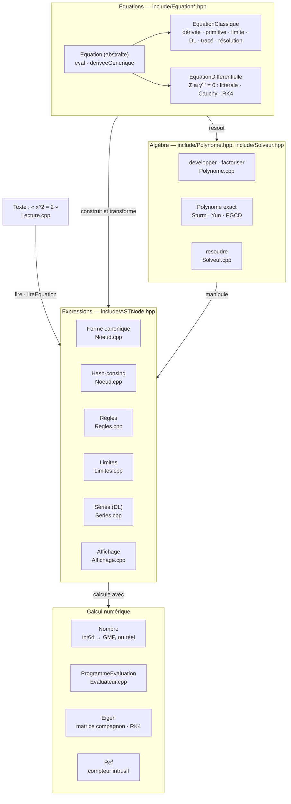
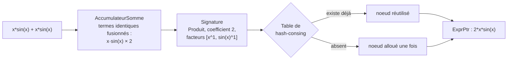
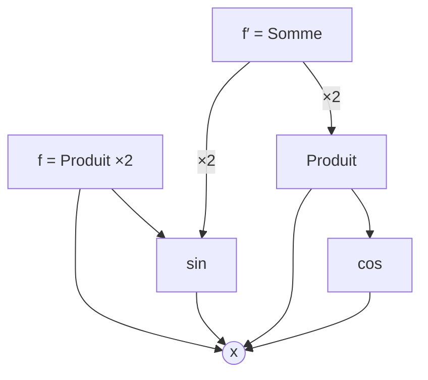
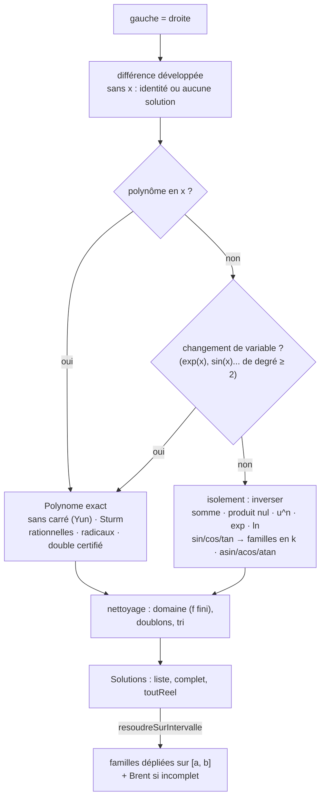

# Architecture de SymAlgo++

Dans SymAlgo++, une expression est un **graphe unique, réduit et partagé**. Ce document suit une expression de sa construction jusqu'à son évaluation, et indique où vit chaque partie du code.

## 1. Trois couches

## 2. Construction d'une expression

Une expression se construit par les helpers C++ ou se lit depuis du texte (`lire`, `src/Lecture.cpp`) : le lecteur découpe le texte en lexèmes de 12 octets (type, position, longueur), puis une descente récursive appelle les mêmes helpers. Les facteurs d'un terme sont multipliés en une fois, si bien que le texte affiché d'une expression se relit en le même nœud.

Il n'y a pas d'étape de simplification séparée : chaque opérateur produit directement la forme réduite, puis vérifie si elle existe déjà en mémoire.

Règles de la forme canonique (`src/Noeud.cpp`, `include/Canonique.hpp`) :

| Écrit | Forme canonique |
| :--- | :--- |
| `x + x` | `2*x` |
| `x * x^2` | `x^3` |
| `2*(x + 1)` | `2*x + 2` |
| `x - y` | `x + (-1)*y` (Somme) |
| `x / y` | `x*y^(-1)` (Produit) |
| `(x^2)^3`, `4^(1/2)`, `exp(ln(x))` | `x^6`, `2`, `x` |
| `8^(1/2)`, `(1/2)^(1/2)`, `ln(8)` | `2*2^(1/2)`, `2^(1/2)/2`, `3*ln(2)` |
| `sin(pi/3)`, `acos(1/2)` | `3^(1/2)/2`, `pi/3` |

## 3. Un graphe partagé, pas un arbre

`x*sin(x) + x*sin(x)` écrit comme un arbre occupe 9 noeuds, dont 4 copies de `x`. SymAlgo++ n'en garde que 3, et la dérivée `f′` réutilise `x` et `sin(x)` :

6 noeuds pour `f = 2*x*sin(x)` et `f′ = 2*x*cos(x) + 2*sin(x)`. Deux expressions identiques étant le même noeud, l'égalité (`estEgal`) est une comparaison d'adresses.

## 4. Les opérations

| Opération | Mécanisme | Exemple réel |
| :--- | :--- | :--- |
| `derivee()` | cache local à l'appel : chaque noeud partagé n'est dérivé qu'une fois | `(2*x*sin(x))′ = 2*x*cos(x) + 2*sin(x)` |
| `derivee("y")` | dérivée partielle : la variable visée est dans le cache de l'appel, un noeud qui ne la contient pas vaut 0 sans être visité (section 6) | `∂/∂y (x^2*y + sin(x*y)) = x^2 + x*cos(x*y)` |
| `simplifier()` | reconstruit l'expression et applique les règles des fonctions ; résultat mémorisé dans le noeud | — |
| `integrer()` | règles par noeud, substitution linéaire ; sinon `IntegraleNonEvaluee` | `∫sin(2x) = -cos(2*x)/2` |
| `limite(a)` | quotient N/D (exposants négatifs), L'Hôpital sur N′/D′ réduit, signe de l'infini par Taylor | `x·ln(x) → 0` en 0 ; `1/x` en 0 non déterminée |
| `DL(a, n)` | arithmétique des séries tronquées, O(n²) par noeud | DL de `exp` en 0 |
| `developper()` | distribution mémorisée, puissances entières de sommes par exponentiation rapide | `(x+1)^3 = x^3 + 3*x^2 + 3*x + 1` |
| `factoriser()` | `Polynome` exact, racines rationnelles, parties primitives | `(x - 1)*(x^2 - 2)` |
| `resoudre()` | voir section 7 | `sin(x) = 1/2` → `pi/6 + 2*pi*k`, `5*pi/6 + 2*pi*k` |
| `eval(x)` / `eval(xs)` | arbre, ou programme compilé si le partage le rend rentable ; blocs vectorisés pour un tableau | `2^100` exact |

Les points d'entrée (`derivee`, `simplifier`, `integrer`, `limite`) sont non virtuels ; les règles propres à chaque noeud sont dans les méthodes protégées `calculerDerivee`, `calculerSimplification`, `primitive` et `calculerLimite`.

## 5. Évaluation compilée

Programme de `(sin(x)+1)·(sin(x)+2)·(sin(x)+4)` produit par `ProgrammeEvaluation` : `sin(x)` n'est calculé qu'une fois et les registres sont réutilisés.

| Instruction | Valeur calculée |
| :--- | :--- |
| `r0 ← 1` | |
| `r1 ← x` | |
| `r1 ← sin(r1)` | sin(x), une seule fois |
| `r0 ← r0 + 1·r1` | sin(x) + 1 |
| `r2 ← 2` | |
| `r2 ← r2 + 1·r1` | sin(x) + 2 |
| `r2 ← r0 · r2` | produit des deux premiers |
| `r0 ← 4` | |
| `r1 ← r0 + 1·r1` | sin(x) + 4 |
| `r1 ← r2 · r1` | résultat |

10 instructions, 3 registres. `eval(xs)` compile toujours et applique chaque instruction à des blocs de 256 points. Pour un point isolé, `EquationClassique` compile à la 8e évaluation et n'utilise le programme que si le partage divise le travail de l'arbre par au moins 1,3.

## 6. Plusieurs variables

* Un noeud `Variable` est identifié par son **nom** : chaque nom reçoit un identifiant de 16 bits (registre interne), et chaque noeud mémorise l'identifiant de son unique variable, ou `AUCUNE_VARIABLE` / `PLUSIEURS_VARIABLES`. Ce champ remplace l'ancien booléen « contient une variable » : il tient dans le même octet de remplissage, la taille des noeuds ne change pas.
* `derivee(variable)` place l'identifiant visé dans le `CacheDerivees` de l'appel. Un noeud dont la variable est une autre (ou aucune) est de dérivée nulle sans être parcouru ; seul `Variable::calculerDerivee` compare l'identifiant. Les autres règles (somme, produit, chaîne) sont inchangées.
* `derivee()` sans argument garde son comportement pour une seule variable, quel que soit son nom, et lève `std::invalid_argument` s'il y en a plusieurs. Intégrale, limite, DL, résolution et évaluation en un réel supposent une seule inconnue : elles refusent (ou laissent non évaluées) les expressions à plusieurs variables.
* `Multivariable.hpp` : `variables`, `gradient`, `jacobienne`, `hessienne` (triangle supérieur, recopié), `laplacien`, `divergence`, `deriveeMixte`, `evaluer(expression, valeurs)`.
* `ProgrammeEvaluation(expressions, entrees)` compile plusieurs sorties de plusieurs variables dans un même programme : `Code::Variable` porte le numéro de l'entrée, et le graphe étant partagé, un gradient et sa hessienne réutilisent leurs sous-expressions communes (voir `examples/`).

## 7. Résolution d'équations

* Une racine de polynôme est isolée dans un intervalle **rationnel exact** (suites de Sturm, bissection exacte), puis reconnue exactement (candidats p/q) ou raffinée jusqu'à deux `double` adjacents : la valeur rendue est le `double` le plus proche.
* Un polynôme à coefficients réels (non exacts) donne des racines seulement approchées.
* `complet = false` signale qu'une forme n'a pas pu être résolue exactement : les solutions listées sont justes, mais il peut en manquer.

## 8. Mémoire et sûreté

* `ExprPtr = Ref<ASTNode>` : compteur de références stocké dans le noeud (une allocation par noeud, libération immédiate du dernier usage, retrait automatique de la table de hash-consing).
* Les noeuds ne se créent que par `fabriquer<T>()` et les helpers (clé `CleFabrique`) : jamais sur la pile.
* `comme<T>(e)` remplace `dynamic_cast` (comparaison du type stocké sur un octet) et refuse de compiler sur un temporaire.
* Comme GiNaC, une expression ne se partage pas entre threads (compteur non atomique).
* `make check` exécute toute la suite de tests sous AddressSanitizer et UBSan.

## 9. Où vit chaque partie

| Fichier | Rôle |
| :--- | :--- |
| `include/ASTNode.hpp` | classes des noeuds, signatures, helpers et opérateurs publics |
| `include/Ref.hpp` | pointeur à compteur de références intrusif |
| `include/Canonique.hpp` | accumulateurs de sommes et de produits (usage interne) |
| `include/Nombre.hpp`, `src/Nombre.cpp` | rationnels exacts (int64 puis GMP) et réels |
| `src/Noeud.cpp` | table de hash-consing, ordre total, construction canonique |
| `src/Regles.cpp` | évaluation, dérivées, simplification et primitives par noeud |
| `src/Limites.cpp` | limites : quotients, L'Hôpital, signe de l'infini |
| `src/Series.cpp` | développements limités par séries tronquées |
| `src/Affichage.cpp` | écriture lisible avec précédences et quotients |
| `include/Lecture.hpp`, `src/Lecture.cpp` | lecture depuis du texte : lexèmes compacts, descente récursive, erreurs positionnées |
| `include/Polynome.hpp`, `src/Polynome.cpp` | `developper`, `Polynome` exact (Sturm, Yun), `factoriser` |
| `include/Solveur.hpp`, `src/Solveur.cpp` | résolution exacte, familles trigonométriques, recherche numérique |
| `include/Multivariable.hpp`, `src/Multivariable.cpp` | variables, gradient, jacobienne, hessienne, laplacien, évaluation à plusieurs variables |
| `include/Evaluateur.hpp`, `src/Evaluateur.cpp` | compilation en programme linéaire (plusieurs entrées et sorties), évaluation par blocs |
| `CMakeLists.txt`, `cmake/` | construction, installation, `find_package` et pkg-config |
| `examples/` | cas d'usage complets qui vérifient leur résultat |
| `src/Equation*.cpp` | équations classiques et différentielles (Eigen, RK4) |

Les mesures de performance, chantier par chantier, sont dans [`benchmarks/RESULTATS.md`](../benchmarks/RESULTATS.md).
